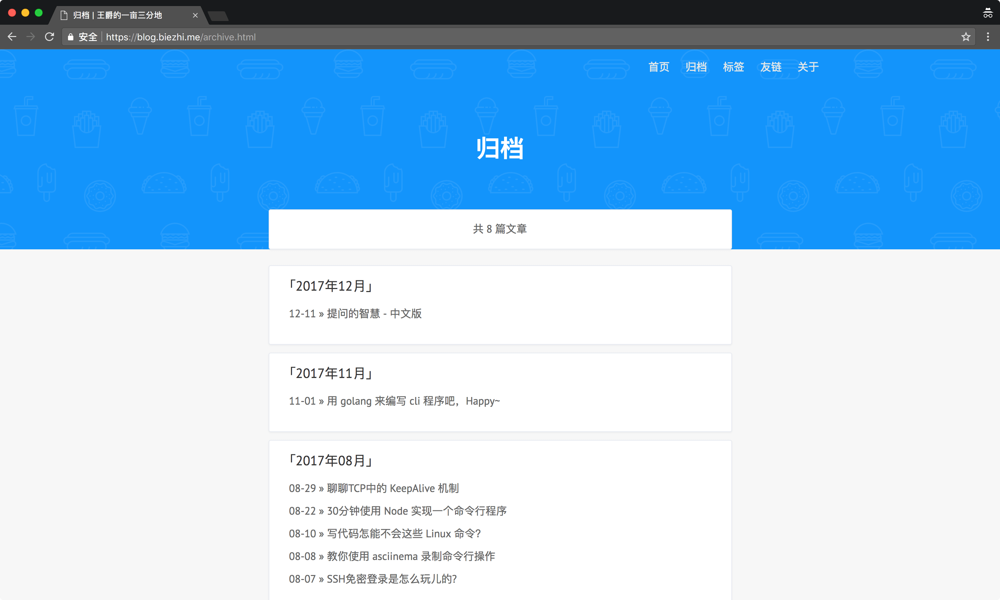
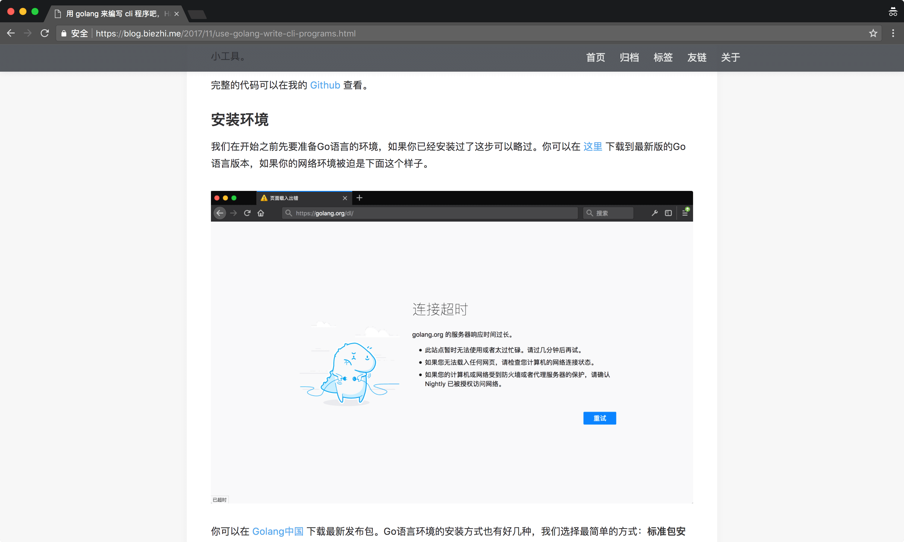
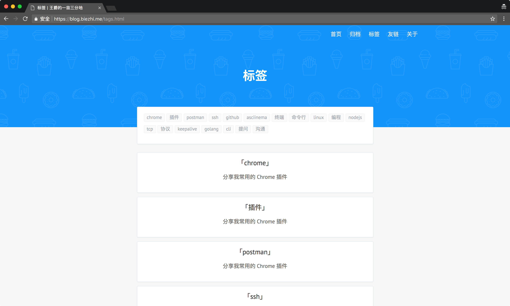

# Jekyll Blog

这是一个 `Jekyll` 主题的模板，修改自 [theme-H2O](https://github.com/kaeyleo/jekyll-theme-H2O) 及 [biezhi](https://github.com/biezhi/blog)，感谢 `MIT LICENSE` 以及上述两位作者给我们提供这么漂亮的主题。我也此基础上自定义了部分内容，并且创作了配套的文档同步工具 [wiki2post](https://github.com/louisun/wiki2post)。

原主题基于 `Jekyll3` + `Gulp` 构建的。

> **插播广告：**
> 致 Linux / Mac OS 用户
> 1. 强烈建议使用上述 [wiki2post](https://github.com/louisun/wiki2post) 进行本地文档管理和自动化部署。
> 2. 推荐使用 [Markdown-Image-CLI](https://github.com/louisun/Markdown-Image-CLI) （截图、复制）图片到剪贴板后自动上传图床并返回 Markdown 格式
> 
> 你将会获得更加愉悦的写作体验

## 预览

**首页**

    

**归档**

    

**文章详情**

    

**标签**

    

## 如何使用

- 克隆代码到本地：`git clone https://github.com/biezhi/blog.git`
- `boudle install`
- `jekyll serve` 即可启动

## License

[MIT](LICENSE)
